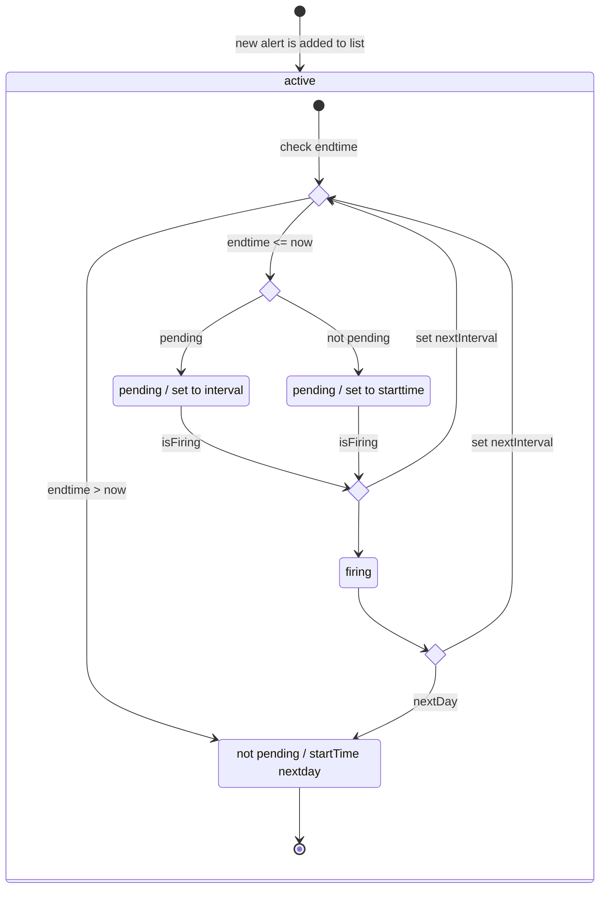

# WindEscalator App

Simple wind alerting app for Android in Kotlin.

##### Table of Contents
[What is it?](#what-is-it) 
[Technologies](#technologies) 
[Getting Started](#getting-started) 

## What is it?

Android-App to alert driven windsurfers in Thun when the local Ober-Wind kicks in.

## Technologies

- Android SDK v33 (min v26)
- Kotlin 1.8.0
- Dagger 2.33
- Lifecycle 2.4.1
- Room 2.5.1 

## Getting Started

The app is not released yet, so you have to build a debug apk. 
Download the app by cloning this repository and use the `gradlew installDebug` command to build and install the project directly on your connected device or running emulator.

### Connect your device 

Follow these steps to connect your device:

1. Connect your device by USB
2. Enable 'Developer options > USB debugging' on your device (Developer options is hidden by default. To make it available, go to 'Settings > About phone' and tap 'Build number' seven times)
3. Now you should see your device with `adb device -l` (if not use `adb usb` to activate usb-connection)
> optional connection by wifi
4. Activate Wifi-Connection
5. `adb tcpip 5555`
6. `adb connect <XXX.XXX.X.XXX>:5555` > add the ip-adress of your device ('Settings > About phone > Status')
7. Enjoy

### BrainDump

Simplyfied AlertHandling

#### Alert states

